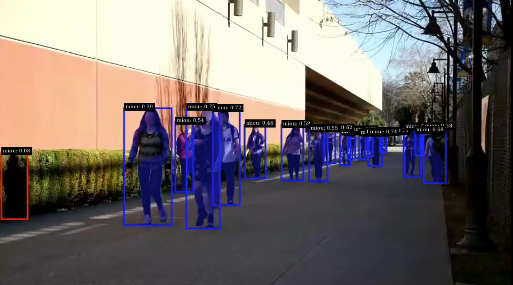

# Introduction

`fpfilter` plugin filters false positive bounding boxes from primary detector's predictions using output 
from (assessor) models trained for similar tasks.

## Segmentation Model Assessor

For every bounding box predicted by the primary detector model, mask iou(miou) is calculated using segmentation
model's output. Bounding boxes with less miou than a threshold(configurable) will be filtered out.




Here, in the above samples, red bounding boxes are being filtered out. In the left side of the above samples, a random shape is being detected as person by primary bounding box model. Whereas assessor segmentation model identifies it as a false positive and `fpfilter` plugin filters it out.

## Bounding Box model Assessor

Similar to Segmentation model assessor, iou is calculated between primary and assessor model's predictions. Primary model's predicted bounding boxes with iou less than a threshold(configurable) are filtered out.

NOTE:
`fpfilter` plugin supports multiple assessor segmentation and bounding box models. False positives can be filtered more accurately by using numerous assessor models.

## Tracker

If the assessor models are not accurate enough, some true positives will be eliminated as well. To reduce the true positives that are being eliminated by assessor models, fpfilter supports tracker based post processing. If a bounding box around an object in current frame is marked as false positive by assessor models but the bounding boxes around the same object in previous few frames were marked as true positive, then the bounding box in the current frame will not be eliminated. Bounding boxes are tracked in previous frames using tracker id assigned by tracker. To use this feature of `fpfilter` plugin, tracker needs to be part of the pipeline.


# About this application

This application shows how to use `fpfilter` plugin for filtering false positive images and filtered images for  active learning. Please check ds_fpfilter_config.txt for more information about configurable parameters.

## Active Learning
`fpfilter` plugin attaches number of false positives and true positives it detected in a frame to user metadata of each frame. Application filters frames with high false positives and uploads the frames to cloud for labelling and retraining the model. Images are uploaded to S3 bucket using boto3. Currently, uploading is only supported for `multifilesrc` source element. This is just a reference implementation showing how `fpfilter` plugin can be used for active learning.

Application also supports linking and unlinking of `fpfilter` plugin, assessor models into the pipeline during runtime. Saving frames with high false positives can also be enabled dynamically during run time. User can send commands to the pipeline using `ds-fpfilter-manager` application through which user can enable false positive filtering and saving frames to cloud anytime he/she wants. `ds-fpfilter-manager` communicates with Deepstream application using simple client-server mechanism where messages are sent to DS app in json format.

## Build and Execution:

Download the application into deepstream preferably into sample_apps folder (/opt/nvidia/deepstream/deepstream-5.1/sources/apps/sample_apps) and copy the plugin library(libnvdsgst_fpfilter.so) to 
/opt/nvidia/deepstream/deepstream-5.1/lib/gst-plugins/ folder.

Download models from ngc and change the paths in config files accordingly.
The application supports mp4, h264 and multiple jpeg files as input source. Also, application supports file as well as video render output. By default mp4 source and file sink are enabled. Input and output formats can be changed from `Makefile` by choosing different build flags. Application also saves kitti labels of the bounding boxes frame by frame.

Commands:

```
    $ export CUDA_VER=<cuda_version>
    $ pip install boto3
    $ make
    $ ./deepstream-fpfilter-app <location_of_mp4_input> <location_to_save_kitti_labels> <location_to_save_output_video>
```

Note:
If you're getting plugin or element not found error, please delete cache:   
`rm $HOME/.cache/gstreamer-1.0/registry.x86_64.bin`

## `fpfilter` Manager

By default `fpfilter` is enabled and uploading the images with high false positives to cloud is disabled. Using fpfilter manager application, user can manage the application during runtime without interrupting pipeline by sending json messages. User can enable and disable the fpfilter while pipeline is running. User can also enable uploading frames with high fp to cloud during runtime and also set the duration of upload. To upload, please set S3 credentials and other essential info by following instructions in `upload_images_s3.py`.

Sample messages:

<table>
<tr>
<th>To enable `fpfilter` plugin during runtime:</th>
<th>To disable `fpfilter` plugin during runtime:</th>
</tr>
<tr>
<td>

```json
{
    "message" : [
        {
            "target"            :   "fpfilter",
            "action"            :   "enable"
        }
    ]
}
```

</td>
<td>

```json
{
    "message" : [
        {
            "target"            :   "fpfilter",
            "action"            :   "disable"
        }
    ]
}
```

</td>
</tr>
</table>

<table>
<tr>
<th>To enable saving images to cloud if fpfilter is already enabled:</th>
<th>To disable saving images to cloud during runtime:</th>
</tr>
<tr>
<td>

```json
{
    "message" : [
        {
            "target"            :   "fpfilter",
            "action"            :   "save-fp-enable"
        }
    ]
}
```

</td>
<td>

```json
{
    "message" : [
        {
            "target"            :   "fpfilter",
            "action"            :   "save-fp-disable"
        }
    ]
}
```

</td>
</tr>
</table>

To enable saving images to cloud for a duration (in milliseconds):

```json
{
    "message" : [
        {
            "target"            :   "fpfilter",
            "action"            :   "save-fp-enable",
            "duration"          :   100
        }
    ]
}
```


To send message to the DS pipeline during runtime:

`
    $ ./ds-fpfilter-manager -m <path-to-file-containing-json-message>
`
